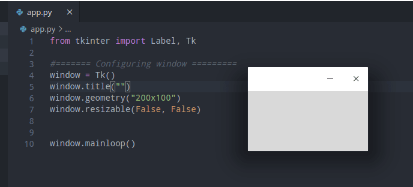
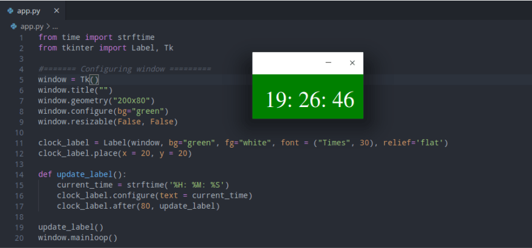

Hi guys,

In this article, I'm going to share with you how to build a digital clock using Python programming in just a few lines of code using the Tkinter and Time module.

#### Requirements

If you're on *window OS* you don't really need to install anything since our simple digital clock app will be using only built-in modules *[time](https://docs.python.org/3/library/time.html)* and *[Tkinter](https://docs.python.org/3/library/tkinter.html)*

But if you're running *Linux OS* most of the time pre installed python interpreter doesn't come with the *Tkinter* installed, therefore you might need to install it manually just as shown below;

#### Installation

```bash
sudo apt-get install python3-tk
```

Now that everything is installed, lets's build our digital clock,

#### Let's get started ....

The idea is really simple, firstly we will create an empty window using the Tkinter, then we gonna *configure* and place a Label widget within our empty window, and then finally we will be updating the value of the label to be the current time after every 0.08s.

#### getting current time ....

Time module provides a variety of ways of getting time, In this article, we are going to use* strftime()* to parse the current time into the *Hour: Minutes: Seconds* format.

##### Example of usage

```python
>>import time
>>time.strftime('%H:%M:%S')
'18:10:53'
```

#### Now lets add graphical interface

Previous experience with the Tkinter library would be an advantage for you, but even if this is your first time still you can make it, the syntax is *intuitive* and straight forward.

##### Making empty window with tkinter

In making an empty clock window, we gonna use geometry () to specify the dimension of the displayed window, and at the end put **mainloop()** to prevent the displayable window from exiting immediately.

```python
from tkinter import Label, Tk

#======= Configuring window =========
window = Tk()
window.title("digital clock")
window.geometry("200x200")
window.resizable(False, False)

#============ Logic lives here =======

window.mainloop()

```

When you run the above code, it will produce an interface like this;



##### Adding some logic to our code ..

Now that we have our empty window, let's now add a label to place our time information together with a function to update the value on the label every 80 milliseconds.

```python
clock_label = Label(window, bg="green", fg="white", font = ("Times", 30), relief='flat')
clock_label.place(x = 20, y = 20)

def update_label():
    current_time = strftime('%H: %M: %S')
    clock_label.configure(text = current_time)
    clock_label.after(80, update_label)

update_label()
```

##### why 80 milliseconds?

According to research human brain can only process 12 separate images per second, anything more than that it will be perceived as a single picture, this is what causes the illusion of motion.

Below is the full code of our digital clock, with you, can try changing the code parameter the way you would like and then press run again.

```python
from time import strftime
from tkinter import Label, Tk

#======= Configuring window =========
window = Tk()
window.title("")
window.geometry("200x80")
window.configure(bg="green")
window.resizable(False, False)

clock_label = Label(window, bg="green", fg="white", font = ("Times", 30, 'bold'), relief='flat')
clock_label.place(x = 20, y = 20)

def update_label():
    current_time = strftime('%H: %M: %S')
    clock_label.configure(text = current_time)
    clock_label.after(80, update_label)

update_label()
window.mainloop()
```

Once you run the above lines of code, you should be seeing a widget with clock details rendered on your machine similar to that screenshot below;



Based on your interest I recommend you to also check these;

-   [](https://kalebujordan.com/make-your-own-music-player-in-python/)[How to make a music player in python](https://kalebujordan.com/make-your-own-music-player-in-python/)
-   [How to track phone number in Python](https://kalebujordan.com/how-to-track-phone-number-in-python/)
-   [How to make a python GUI calculator in Python](https://kalebujordan.com/python-gui-calculator/)
-   [How to make a guessing game in Python](https://kalebujordan.com/guessing-game-in-python/)
-   [How to program Arduino board with Python](https://kalebujordan.com/control-your-arduino-board-with-python/)
-   [How to build a website blocker in Python](https://kalebujordan.com/how-to-build-website-blocker-in-python/)
