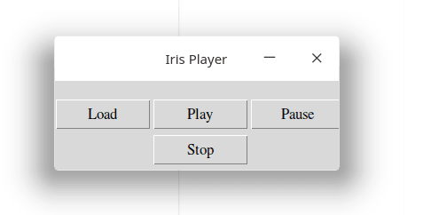

#### Requirements

To be able to follow this tutorial you need to have *Tkinter* and *pygame* installed on your machine

#### Installation

- Linux

```python
sudo apt-get install python3-tk

pip3 install pygame
```

​
- Window
```python
pip install pygame
```

Now once everything is ready Installed, we now ready to begin coding our very own *music player*

#### Let's get started

We gonna use Tkinter to render our application *menu* and *buttons*, and also *loading* the music from files and then pygame library to *play,* *pause* and *stop* the music

#### Basics of pygame

**Pygame** has an inbuilt method called *mixer ()* which provides us intuitive syntax on dealing with sounds files in python, we will see ;

-   loading and playing music
-   pausing and unpausing music
-   stoping the music file

#### loading and playing music with pygame

To play music with *pygame* you're firstly supposed to import *mixer()*, initialize it through *init(), *and then using *music.load()* to load the music and finally playing it with *music.play()*.

#### Example of usage

```python
from pygame import mixer

mixer.init() #Initialzing pyamge mixer

mixer.music.load.('filename.mp3') #Loading Music File

mixer.music.play() #Playing Music with Pygame

```
#### Pausing and unpausing music with pygame.

use* music.pause()* and* music.unpause()* to pause and unpause your music, but make your music file is loaded first before using these methods.

Example of usage 

```python
mixer.music.pause() #pausing music file

mixer.music.unpause() #unpausing music file
```
#### Stop a music file

use *music.stop()* to stop your music completely from playing, once you use this method the loaded music will be cleared in pygame memory.

```python
mixer.music.stop()
```

#### Building your music player exoskeleton

We have already covered the basics of playing music with python, now it's time to begin designing our application user interface{UI) and then link together with the logics.

#### First Let us import all necessary Library

```python
from tkinter import *

from tkinter import filedialog

from pygame import mixer
```


#### Let's now implement our class & Buttons for our application

```python
class MusicPlayer:
    def __init__(self, window ):
        window.geometry('320x100'); window.title('Iris Player'); window.resizable(0,0)
        Load = Button(window, text = 'Load',  width = 10, font = ('Times', 10), command = self.load)
        Play = Button(window, text = 'Play',  width = 10,font = ('Times', 10), command = self.play)
        Pause = Button(window,text = 'Pause',  width = 10, font = ('Times', 10), command = self.pause)
        Stop = Button(window ,text = 'Stop',  width = 10, font = ('Times', 10), command = self.stop)
        Load.place(x=0,y=20);Play.place(x=110,y=20);Pause.place(x=220,y=20);Stop.place(x=110,y=60)
        self.music_file = False
        self.playing_state = False
```

Let's now add the method to the class we just made to load music file from our computer, just as shown in the code below

#### Adding Load Method to our MusicPlayer class

```python
class MusicPlayer:
    def __init__(self, window ):
        window.geometry('320x100'); window.title('Iris Player'); window.resizable(0,0)
        Load = Button(window, text = 'Load',  width = 10, font = ('Times', 10), command = self.load)
        Play = Button(window, text = 'Play',  width = 10,font = ('Times', 10), command = self.play)
        Pause = Button(window,text = 'Pause',  width = 10, font = ('Times', 10), command = self.pause)
        Stop = Button(window ,text = 'Stop',  width = 10, font = ('Times', 10), command = self.stop)
        Load.place(x=0,y=20);Play.place(x=110,y=20);Pause.place(x=220,y=20);Stop.place(x=110,y=60)
        self.music_file = False
        self.playing_state = False
    def load(self):
        self.music_file = filedialog.askopenfilename()
```

After Loading the Music file from the file we need a function to Play our Music File, Let's make it using the concepts we just learned above.

#### Adding Play Method to our class

```python
class MusicPlayer:
    def __init__(self, window ):
        window.geometry('320x100'); window.title('Iris Player'); window.resizable(0,0)
        Load = Button(window, text = 'Load',  width = 10, font = ('Times', 10), command = self.load)
        Play = Button(window, text = 'Play',  width = 10,font = ('Times', 10), command = self.play)
        Pause = Button(window,text = 'Pause',  width = 10, font = ('Times', 10), command = self.pause)
        Stop = Button(window ,text = 'Stop',  width = 10, font = ('Times', 10), command = self.stop)
        Load.place(x=0,y=20);Play.place(x=110,y=20);Pause.place(x=220,y=20);Stop.place(x=110,y=60)
        self.music_file = False
        self.playing_state = False
    def load(self):
        self.music_file = filedialog.askopenfilename()
	def play(self):
        if self.music_file:
            mixer.init()
            mixer.music.load(self.music_file)
            mixer.music.play()
```

After adding the Play Method to our class we need a Method to pause and unpause & also to Stop the Music

#### Finally Let's add the pause and stop method to our class

```python
class MusicPlayer:
    def __init__(self, window ):
        window.geometry('320x100'); window.title('Iris Player'); window.resizable(0,0)
        Load = Button(window, text = 'Load',  width = 10, font = ('Times', 10), command = self.load)
        Play = Button(window, text = 'Play',  width = 10,font = ('Times', 10), command = self.play)
        Pause = Button(window,text = 'Pause',  width = 10, font = ('Times', 10), command = self.pause)
        Stop = Button(window ,text = 'Stop',  width = 10, font = ('Times', 10), command = self.stop)
        Load.place(x=0,y=20);Play.place(x=110,y=20);Pause.place(x=220,y=20);Stop.place(x=110,y=60)
        self.music_file = False
        self.playing_state = False
    def load(self):
        self.music_file = filedialog.askopenfilename()
	def play(self):
        if self.music_file:
            mixer.init()
            mixer.music.load(self.music_file)
            mixer.music.play()
    def pause(self):
        if not self.playing_state:
            mixer.music.pause()
            self.playing_state=True
        else:
            mixer.music.unpause()
            self.playing_state = False
    def stop(self):
        mixer.music.stop()
```
#### Let's look at our Final will app (app.py)

```python
from tkinter import *
from tkinter import filedialog
from pygame import mixer

class MusicPlayer:
    def __init__(self, window ):
        window.geometry('320x100'); window.title('Iris Player'); window.resizable(0,0)
        Load = Button(window, text = 'Load',  width = 10, font = ('Times', 10), command = self.load)
        Play = Button(window, text = 'Play',  width = 10,font = ('Times', 10), command = self.play)
        Pause = Button(window,text = 'Pause',  width = 10, font = ('Times', 10), command = self.pause)
        Stop = Button(window ,text = 'Stop',  width = 10, font = ('Times', 10), command = self.stop)
        Load.place(x=0,y=20);Play.place(x=110,y=20);Pause.place(x=220,y=20);Stop.place(x=110,y=60) 
        self.music_file = False
        self.playing_state = False
    def load(self):
        self.music_file = filedialog.askopenfilename()
    def play(self):
        if self.music_file:
            mixer.init()
            mixer.music.load(self.music_file)
            mixer.music.play()
    def pause(self):
        if not self.playing_state:
            mixer.music.pause()
            self.playing_state=True
        else:
            mixer.music.unpause()
            self.playing_state = False
    def stop(self):
        mixer.music.stop()
root = Tk()
app= MusicPlayer(root)
root.mainloop()
```

### Output


If you run the above code the output will be as shown below, now you can play around with it by loading, playing, pausing, and stopping the music, full demo in youtube link at the end of the article.



#### [View demo on youtube](https://youtu.be/Zg_czm5kOeg)
 
Based on your interest I recommend you to also check these;

-   [How to make a digital clock in Python](https://kalebujordan.com/how-to-make-a-digital-clock-in-python/)
-   [How to track phone number in Python](https://kalebujordan.com/how-to-track-phone-number-in-python/)
-   [How to make a python GUI calculator in Python](https://kalebujordan.com/python-gui-calculator/)
-   [How to make a guessing game in Python](https://kalebujordan.com/guessing-game-in-python/)
-   [How to program Arduino board with Python](https://kalebujordan.com/control-your-arduino-board-with-python/)
-   [How to build a website blocker in Python](https://kalebujordan.com/how-to-build-website-blocker-in-python/)


In case of any *comment*,*suggestion* or *difficulties* drop it on the comment box below, and then I will get back to you ASAP.

